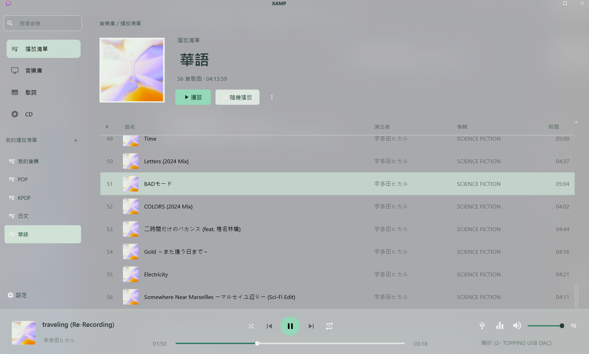
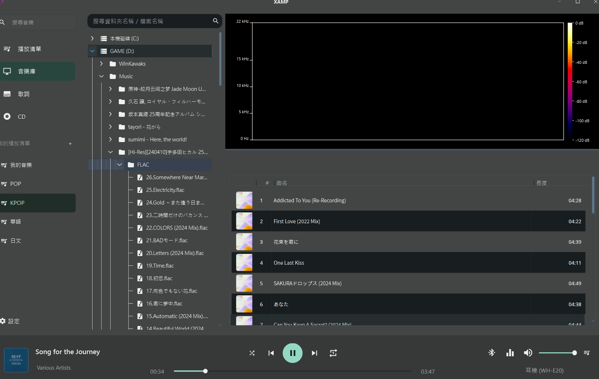

# XAMP 2

專注本機音樂的 Windows 桌面播放器：播放清單、專輯封面、歌詞、參數等化器，以及 WASAPI／ASIO 音訊輸出。

[下載 Windows 1.0.2 測試版](https://github.com/billlin0904/xamp2/releases/tag/v1.0.2) · [所有版本](https://github.com/billlin0904/xamp2/releases) · [回報問題](https://github.com/billlin0904/xamp2/issues)



*使用者提供的開發版本實機截圖。介面、曲目與配色可能與安裝版本略有差異。*

## 主要功能

- **本機音樂與播放清單**：瀏覽資料夾、搜尋音樂、建立與重新命名播放清單、拖曳調整順序。
- **封面與歌詞**：專輯封面、目前播放資訊及同步歌詞顯示。
- **音訊輸出**：WASAPI 共用／獨佔、ASIO、XAudio2；DSD 模式依檔案、驅動與裝置支援而定。
- **BitPerfect PCM**：WASAPI 獨佔與 ASIO 支援 16／24／32-bit 立體聲整數 PCM WAV、FLAC，保留原始取樣率與有效位元。
- **參數等化器**：多頻段濾波器與前級增益；一般播放模式可使用重取樣與 DSP。
- **外觀與語言**：深色／淺色主題、Windows 11 背景材質，以及繁體中文、英文、日文、韓文介面。
- **軟體更新**：檢查更新、背景下載，下載後手動重新啟動安裝。

## Windows 11 透明背景

在 **設定 → 播放 → 背景材質** 選擇 `Mica` 或 `Acrylic`。

| 材質 | 外觀 |
| --- | --- |
| 關閉 | 一般實色背景 |
| Mica | 較柔和的系統背景材質 |
| Acrylic | 毛玻璃般的模糊與透色效果 |

背景材質需要 **Windows 11 22H2 或更新版本**，並在 Windows「設定 → 個人化 → 色彩」開啟透明效果。高對比模式、關閉系統透明效果或不支援的系統會使用實色背景。

透明效果不是把整個視窗連同文字一起變淡；文字、封面與控制項保持可讀性，背景透出系統材質。實際觀感會隨桌布、視窗後方內容與深淺色主題改變；單色背景下通常較不明顯。



*背景材質開發畫面，取自使用者提供的截圖；其中歌曲列表是統一樣式前的版本。靜態圖片僅展示當時觀感，不代表所有區塊皆完全透明。*

## 下載與安裝

1. 至 [GitHub Releases](https://github.com/billlin0904/xamp2/releases/tag/v1.0.2) 下載 `xamp2-setup.exe`。
2. 執行安裝程式，依指示完成安裝。
3. 從音樂庫瀏覽本機資料夾，或將音樂加入播放清單。

目前提供 Windows x64 測試版，安裝包尚未簽署。Release 同時提供 `SHA256SUMS.txt` 供核對下載檔案。Windows 是主要支援平台；其他平台的原始碼仍在開發，目前未提供安裝包。

## 啟用 BitPerfect

在 **設定 → 輸出** 啟用 BitPerfect PCM，並選擇 **WASAPI 獨佔或 ASIO** 裝置；下次播放生效。

此模式略過 EQ、重取樣與軟體音量，請使用 DAC 或外部設備調整音量。裝置必須支援來源取樣率及足夠的有效位元；不支援的格式會明確拒絕，不會自動降低精度。

自動測試涵蓋整數解碼、位元排列及 FIFO 傳遞，但尚未完成實體裝置的迴路驗證。詳見 [BitPerfect 架構與測試](docs/bitperfect.md)。

## 從原始碼編譯

目前 Windows 開發環境使用 Visual Studio 18、MSVC、Qt 6.8.3，以及專案所需的 FFmpeg、BASS／BASS FX、ASIO SDK 等第三方元件。核心使用 C++20／C++23 功能；第三方路徑仍需依本機環境調整。

開啟 `src/xamp/xamp.sln`，選擇 `Release | x64` 並建置 `xamp`。亦可在 Visual Studio Developer PowerShell 中執行：

```powershell
msbuild src/xamp/xamp.sln /t:xamp /m:1 /nr:false /p:Configuration=Release /p:Platform=x64
```

建置前先關閉輸出目錄中的播放器，避免 DLL 被占用。執行時需具備 Qt runtime、plugins、`components` 與資源目錄；單獨複製 `xamp.exe` 不足以執行。

### 自動測試

先完成 Release 建置，再依 [測試說明](docs/bitperfect.md) 設定 Catch2 測試：

```powershell
cmake --build out/bitperfect-tests --config Release --parallel 6
ctest --test-dir out/bitperfect-tests -C Release --output-on-failure
```

1.0.2 發布前通過 17 項 Catch2 測試，涵蓋 PCM 轉換、解碼與 DSP 繞過、輸出格式、EQ 增益與失敗還原，以及緩衝補資料。

### Windows 打包

```powershell
./tools/Package-WindowsRelease.ps1
```

腳本會部署 Qt runtime、建立 Inno Setup 安裝包、更新 SHA-256，並執行安裝／移除測試。工具路徑可透過腳本參數調整。安裝包位於 `setup/win32/inno/output/xamp2-setup.exe`。

### Intel oneMKL Runtime

專案的 FFT 實作目前會透過 `mkl_rt.2.dll` 載入 Intel oneMKL。  
如果缺少 MKL runtime，執行時可能會出現 `0xC06D007E: Module not found`，而且錯誤不一定會直接指出真正缺少哪一個 DLL。

Windows Debug / Release 發行目錄的 `components` 資料夾需包含以下檔案：

- `mkl_rt.2.dll`
- `mkl_core.2.dll`
- `mkl_intel_thread.2.dll`
- `mkl_cdft_core.2.dll`
- `mkl_def.2.dll`
- `mkl_mc3.2.dll`
- `mkl_avx2.2.dll`
- `mkl_avx512.2.dll`
- `libiomp5md.dll`

上述檔案通常來自：

- `C:\Program Files (x86)\Intel\oneAPI\mkl\2025.0\bin`
- `C:\Program Files (x86)\Intel\oneAPI\compiler\2025.0\bin`

其中 `mkl_intel_thread.2.dll` 會延遲載入 `mkl_core.2.dll` 與 `libiomp5md.dll`；`mkl_core.2.dll` 也會依 CPU 動態載入 `mkl_def.2.dll`、`mkl_mc3.2.dll`、`mkl_avx2.2.dll` 或 `mkl_avx512.2.dll` 等 kernel DLL。  
因此打包時不要只帶 `mkl_rt.2.dll`，否則可能在不同 CPU 或不同執行路徑下才爆出 missing module。

## 授權

XAMP 2 本身使用 MIT License。

本專案也使用多個第三方開源或商業元件，例如 Qt、FFmpeg、BASS、TagLib、OpenCC、QWindowKit、spdlog 等。這些元件分別受其原始授權條款約束。

正式散布 binary 安裝檔時，會盡量保留並整理第三方元件的授權與 notice 資訊。

## 免責聲明

本專案仍在持續開發中。若你遇到無法播放、裝置不相容、歌詞或封面抓取失敗等問題，歡迎回報 issue。
